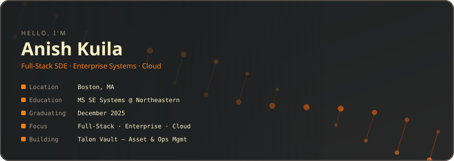

  

 

 

## 🧰 Tech Stack

 

## 🚀 Featured Projects

<table>
<tr>
<td width="50%" valign="top">

### 🔐 [Talon Vault](https://github.com/anishneu/Enterprise-Asset-Management-System-PLM)

Enterprise asset & PLM management system — 66 REST API endpoints, 5-tier RBAC via Keycloak, full Draft→Released document lifecycle with audit trail.

`FastAPI` `React 19` `MySQL` `Keycloak`

</td>
<td width="50%" valign="top">

### 🍳 [Recipe Hub](https://github.com/anishneu/RecipeHub-Full-Stack-Recipe-Discovery-Platform)

Role-based recipe discovery platform — 24 REST APIs, JWT auth, live culinary news feed, Swagger-documented.

**[▶ Live demo](https://anish-recipehub.netlify.app)**

`React` `Node.js` `Express` `MongoDB Atlas`

</td>
</tr>
<tr>
<td width="50%" valign="top">

### 💊 [Medicence Supplies](https://github.com/anishneu/MedicenceSupplies-Medical-Store-Platform)

Medical wholesale commerce platform — Spring Boot 3, role-based catalog/fulfillment, Docker + GitHub Actions CI/CD.

**[▶ Live demo](https://anish-medicencesupplies.netlify.app/)**

`Spring Boot` `React` `TypeScript` `Docker`

</td>
<td width="50%" valign="top">

### 🧠 [Face Detection & Gender ID](https://github.com/anishneu/Face-Detection-and-Gender-Recognition)

Haar-cascade + CNN pipeline trained on CelebA — 99.97% (male) / 94.18% (female) classification accuracy.

`Python` `TensorFlow/Keras` `OpenCV`

</td>
</tr>
</table>

More projects on my <a href="https://anishkuila.netlify.app">portfolio</a>, including a Unity 2D endless runner and a UX case study.

 

## 📊 GitHub Stats

 

## 📫 Reach me

